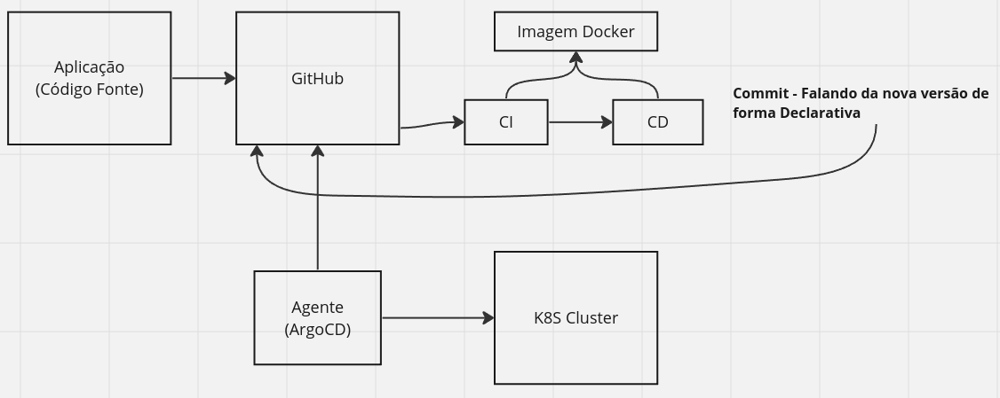
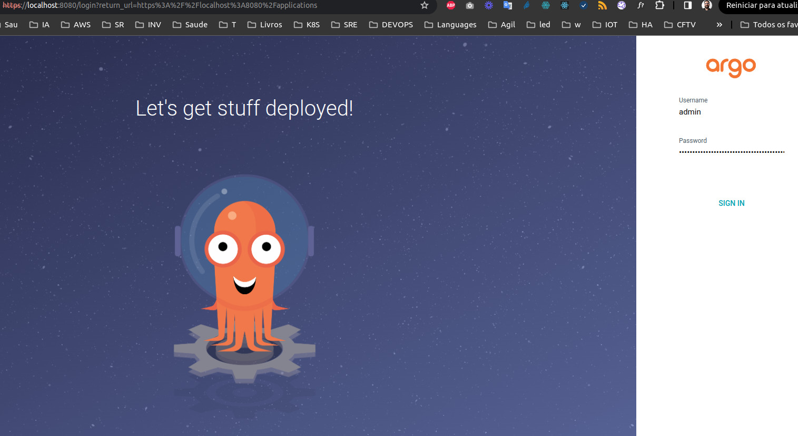
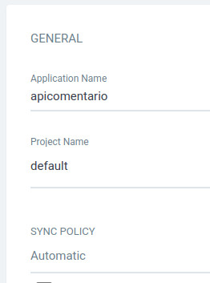
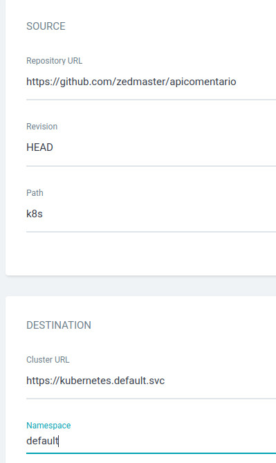
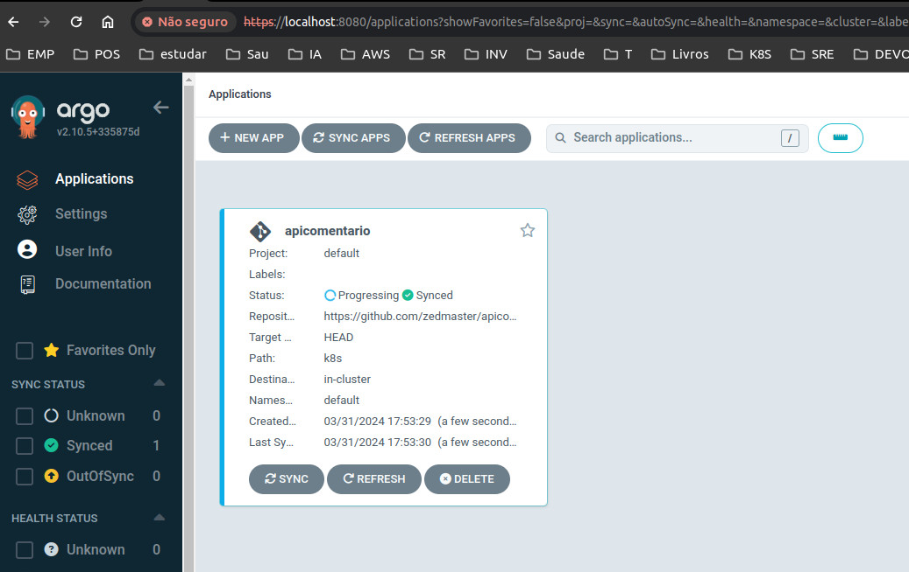
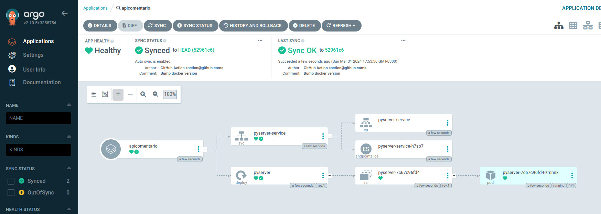
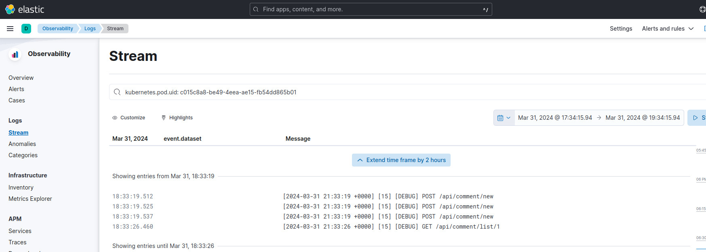
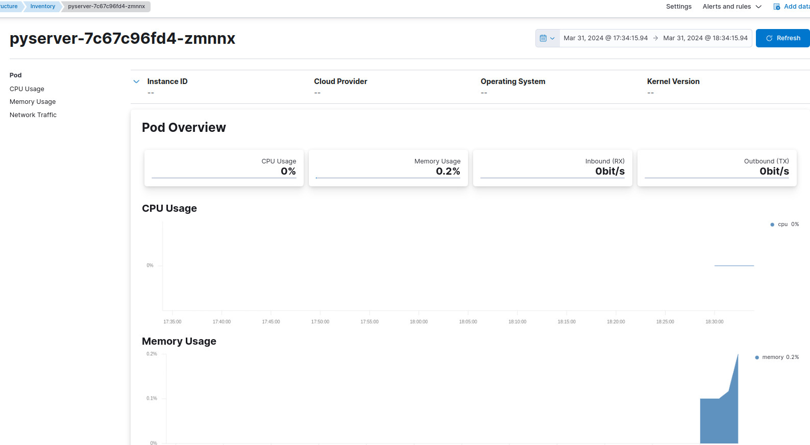

# Arquitetura  da Aplicação

Para automatizar esta aplicação, serão utilizadas ferramentas de containers para realizar o build e o deploy da aplicação.
A utilização de workflows do Github irá ajudar na atomação do build, gerando a imagem do Docker.

A metodologia de automação será a do GitOps.
GitOps é uma prática de operações de TI (Ops) que enfatiza o uso do controle de versão do Git para gerenciar a infraestrutura e a automação de implantação. Em essência, GitOps trata a infraestrutura como código (IaC), aplicando os princípios de desenvolvimento de software para o gerenciamento da infraestrutura.

Para realizar esta automação, contaremos com ferramentas como o ArgoCD, Kind, Kustomize dentre outras.
O fluxo consiste na atualização automatica do POD da aplicação quando qualquer commit for realizado no branch main, gerando mais autonomia, controle e facilidade para os desenvolvedores, que utilizarão uma inferface web para manipular e monitorar as aplicações.





Ferramentas utilizadas:
* **Kind** -  (Kubernetes IN Docker) é uma ferramenta que permite criar clusters Kubernetes usando contêineres Docker como nodes.
* **kubectl** - é uma ferramenta de linha de comando utilizada para interagir com clusters Kubernetes. 
* **Kustomize** - Kustomize é uma ferramenta de linha de comando usada para personalizar configurações de recursos Kubernetes de forma declarativa. 
* **ArgoCD** - ArgoCD é uma ferramenta de entrega contínua (Continuous Delivery - CD) projetada especificamente para ambientes Kubernetes. Ele automatiza o processo de implantação de aplicativos em clusters Kubernetes, permitindo que você mantenha um estado desejado definido por meio de configuração declarativa no Git.
* **Docker** - Docker é uma plataforma de software que permite a criação, o envio e a execução de aplicativos em contêineres. Um contêiner é uma unidade de software leve e portátil que inclui tudo o que um aplicativo precisa para ser executado de forma independente, incluindo código, bibliotecas, dependências e variáveis de ambiente.
* **Elastick Stack** - é composto pelos seguintes produtos: Elasticsearch, Kibana, Beats e Logstash, reunidos ajudam no processo de observabilidade.

# Kind


O Kind, que significa "Kubernetes IN Docker", é uma ferramenta que facilita a execução de clusters Kubernetes em Docker. Ele foi projetado para simplificar o processo de desenvolvimento, teste e experimentação com o Kubernetes, permitindo que você crie clusters Kubernetes em contêineres Docker em sua máquina local.

A escolha para utilização do kind para este teste foi por conta da facilidade de manipulação dos comandos e familiaridade com a ferramenta para desenvolvimento local.


## Configuração do cluster no kind


Criando o cluster para a aplicação:
```
kind delete cluster --name  apicomentario
kind create cluster --name=apicomentario --config=config.yaml
```

Aplicando o contexto do kubectl do novo cluster:
```
kubectl cluster-info --context kind-apicomentario 
```

Para subir a aplicação localmente:
```
kubectl port-forward service/pyserver-service 8000:8000
```

# Kustomize


Instalando o kustomize:
```
sudo snap install kustomize
```


# Instalando ArgoCD
```
helm repo add argo https://argoproj.github.io/argo-helm
helm repo update
helm install argocd argo/argo-cd
```

Pegando o password (utilize o user: admin para efetuar o login)
```
kubectl -n default get secret argocd-initial-admin-secret -o jsonpath="{.data.password}" | base64 -d && echo
```

Para subir o ArgoCD localmente (http://localhost:8080):
```
kubectl port-forward service/argocd-server -n default 8080:443
```



## Campos para criar nova Aplicação:








# Instalando o Helm

```
curl https://raw.githubusercontent.com/helm/helm/master/scripts/get-helm-3 | bash
```


# Instalando Elatic Stack


## Elastic Search
```
helm repo add elastic https://helm.elastic.co
helm repo update

# Instalando o elasticsearch
helm install elasticsearch elastic/elasticsearch --set replicas=1 --set auth.roles.admin_role.privileges.cluster=ALL --set auth.roles.admin_role.privileges.index=ALL --set auth.roles.admin_role.privileges.application=ALL --set auth.users.kibanaadmin.password=kibanabana --set auth.users.kibanaadmin.roles=admin_role
```

## Kibana

Instalação:
```
helm install kibana elastic/kibana --set env.ELASTICSEARCH_USERNAME=kibanaadmin --set env.ELASTICSEARCH_PASSWORD=kibanabana --set env.ELASTICSEARCH_HOSTS=http://elasticsearch-master:9200
```

Criando usuário para log e subindo servidor (http://localhost:5601)
```
kubectl exec -it elasticsearch-master-0 -- bin/elasticsearch-users useradd kibanaadmin -p kibanabana -r superuser
kubectl port-forward svc/kibana-kibana 5601:5601
```


## Instalando os beats
```
helm install filebeat elastic/filebeat -f elastic/filebeat-values.yaml
helm install metricbeat elastic/metricbeat -f elastic/metricbeat-values.yaml
helm install apm-server elastic/apm-server
```


Com os beats instalados o próximo passo é criar o dashboard para monitoramento, assim como a configuração do APM.





# Considerações

## O que faltou

* Faltou a instalação do ambiente em produção, só foi abordado o ambiente de desenvolvimento local, para ficar completo deveria ter feito um cluster EKS na AWS e todo o provisionamento.
* Faltou o dashboard unificado e o APM da aplicação. Infelizmente a escolha de instalar o Elastic Stack dentro do kubernetes não foi muito boa. Os beats não tem um bom suporte dentro de cluster e os mesmos não se comunicam direito com o elasticsearch e não geram automaticamente os dashboards no Kibana, o melhor seria ter instalador o Elastic Stack fora do cluster ou ter utilizado outra solução como o Prometheus + Grafana.
